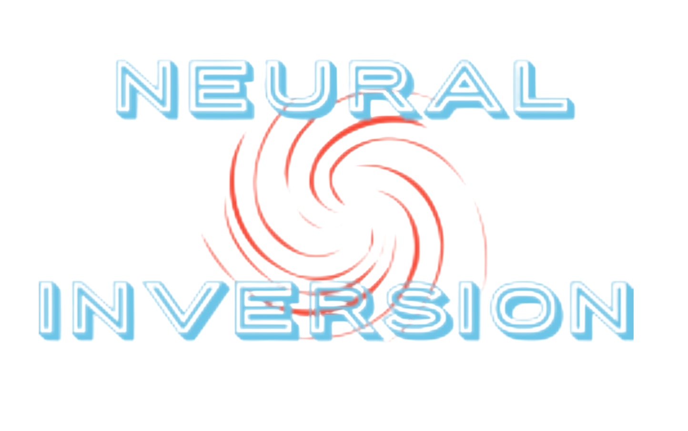

# <p style="text-align:center;">  </p>

`NeuralInversion` approximates the inversion of neural networks. It currently implements inversion 
for StyleGAN, meaning it can take in an image and find the feature vector in StyleGAN latent space with 
which it corresponds. 

## What it does

To do invert neural networks, `NeuralInversion` uses a modified version of *optimizer-based inference* (OBI). OBI calculates the inverse mapping as follows. 
Given an image $y$, initialize a latent vector $x$ and pass it through the pretrained StyleGAN $F$ to compute 
the loss $L(F(x), y)$. $^1$ Take the partial derivatives of $L$ with respect to $x$ and minimize $L$ using gradient 
descent by optimizing $x$. Now pass the new $x$ into $F$ again, and repeat the optimization process for a number of times $T$ (usually $T=20$). $^2$

The problem with this OBI procedure is that the optimization is unstable: The StyleGan $F$ was designed to optimize its parameters, not its input. 
Hence, Liu et al. provide a method to stabilize optimization by smoothing the loss landscape in "Landscape Learning for Neural Network Inversion".
They do this by training another neural network $\theta: Z\rightarrow X$ that predict the input vector $x \in X$ using a vector from another space $z \in Z$
with a smooth loss landscape. The mapping network $\theta$ is trained to minimize the loss $L(F(\theta(z_t)), y)$ where $t\in T$. $^3$ From this training,
$\theta$ learns patterns in the optimization trajectories of $X$ and can act to stabilize them, learning a loss landscape where gradient descent is efficient, 
and accelerating the inversion process.

## How to use
First, install the dependencies needed to use `NeuralInversion` as follows. 

```shell
conda create -n neuralinversion python
conda activate neuralinversion
conda install -c conda-forge numpy torchvision tqdm
pip install torchmetrics
```

Make sure to activate your conda environment and `cd` into the `NeuralInversion` directory. 
And before running any scripts, modify the `Configuration` class in the `train` or `eval` 
python files according to your run configuration.

To train from scratch, run train.py as follows.

```
python src/train.py
```

If you already have pretrained weights for the mapping network, run the following line.

```
python src/eval.py
```

The pretrained weights for the StyleGAN $F$ are available in this [google drive](). 
Weights for $\theta$ are also available there, but note from $^3$ that they are not fully pretrained.

You will see the output images in the `output` directory.

## Technical Notes
[1] The loss used here is $L(\hat{y}, y) := \frac{1}{volume(y)} \times SquaredEuclideanDistance(\hat{y}, y) + LearnedPerceptualImagePatchSimilarity(\hat{y}, y)$.
SquaredEuclideanDistance measures how far apart corresponding pixel values are in $\hat{y}$ and $y$. LearnedPerceptualImagePatchSimilarity uses a neural network
such as AlexNet to classify the semantic similarity between two images. See my article 
[Image Similarity: Theory and Code](https://towardsdatascience.com/image-similarity-theory-and-code-2b7bcce96d0a) for the essentials of image similarity.  

[2] Mathematically, the OBI procedure is as follows: for each element $x_i$ and for $t \in T$ steps, compute $x_{t, i} = x_{t-1, i} + \alpha\frac{\partial L}{\partial x_i}$ where $\alpha$ is the learning rate. 

[3] Precisely, this entails first collecting together optimization trajectories into a buffer $B := \{\{z\}_{t=1}^T\}_{i=1}^N$ where $T$ is the number of optimization steps and $N$ is the number of data samples in a buffer, and where $z_{t, i} = z_{t-1, i} + \alpha\frac{\partial L}{\partial x_i}$. Then, iteratively sample a vector $z_{i, t}$ and minimize $L(F(\theta(z_{i,t})), y_i)$ by performing gradient descent on each weight $w$ of $\theta$, $w_{t, i} = x_{t-1, i} + \alpha\frac{\partial L}{\partial w_i}$, repeating until convergence.

[4] The mapping network $\theta$ was only trained on 10 images. 
Liu et al. trained the mapping network on a 4-GPU cluster with at batch size of 256, but I was only able to support a batch 
size of 1 on my local resources.

## What it implemented
```
@misc{https://doi.org/10.48550/arxiv.2206.09027,
  doi = {10.48550/ARXIV.2206.09027},

  url = {https://arxiv.org/abs/2206.09027},
  
  author = {Liu, Ruoshi and Mao, Chengzhi and Tendulkar, Purva and Wang, Hao and Vondrick, Carl},
  
  keywords = {Computer Vision and Pattern Recognition (cs.CV), Machine Learning (cs.LG), FOS: Computer and information sciences, FOS: Computer and information sciences},
  
  title = {Landscape Learning for Neural Network Inversion},
  
  publisher = {arXiv},
  
  year = {2022},
  
  copyright = {arXiv.org perpetual, non-exclusive license}
}
```
Pretrained weights for the StyleGAN were obtained in an [Image2StyleGAN repository](https://github.com/zaidbhat1234/Image2StyleGAN).
